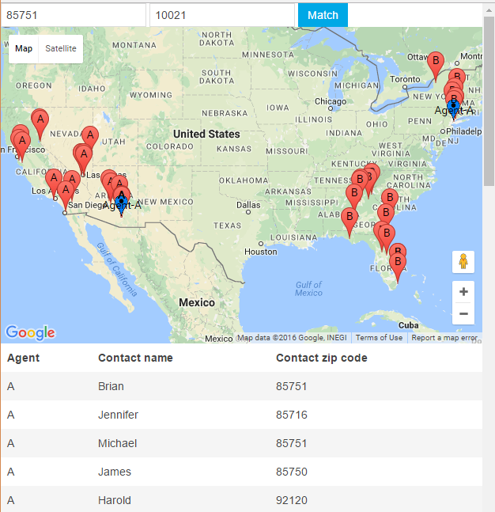

# Closest contacts by zipcode

The goal of this example is to match agents vs clients based on their zip codes

## Running the project

Once the project has been cloned into a local folder, it can be easily run be executing PHP built-in server
php -S localhost:8080

For the seak of simplicity the project has been configured to use a SQlite as database

## Migrations and seeds

This project includes Laravel migrations for its 3 tables:

* contacts
* zipcodes
* agents (created but not used)

The project has a seeder for the contacts table, this seeder takes the information from the file "database/seeds/contacts.csv"

## Custom commands

Source files:
* app/Console/Commands/CacheZipcodes.php

### zipcode:cache

It was included a custom command for feeding the zipcodes table, in order to execute this command call:

php artisan zipcode:cache

Steps: 
1. Truncate zipcodes table
2. Get a list of the zip codes used by the contacts
3. Call an external API in order to convert the zip codes to latitude-longitude (API provider: https://www.zipcodeapi.com/) 
4. Create zipcodes records with the following information: [zip code, latitude, longitude]

http://www.zipcodeapi.com/ is used instead of Google Maps because it allows multiple zip code conversion

### zipcode:update

TODO: This command is not available yet
It is aimed to add missing zip codes instead of truncating the table

## Environment variables

ZIP_CODE_API_KEY: This is the key for https://www.zipcodeapi.com/ API

## Arquitecture

### Back-end

#### API

##### GET /api/contact/match-closer/{zip code 1},{zip code 2}

This request groups the contact into two groups according to their distance to the zip codes provided. It balances the amount of contacts given to each agent.

Source files:
* routes/api.php
* app/Http/controllers/ContactController.php
* app/Agent.php
* app/Contact.php
* app/Zipcode.php
* app/Repositores/Air.php (Used for cache purpose, it works well for a light project but it is recommended to switch to REDIS in a huge project)
* app/Repositores/ZipcodeRepository.php

### Front-end

##### GET /

Provides a form with two inputs and a match button. Both input are for a single zip code, after clicking the match button an ajax request is done to the API. Once the API responses with an array of objects, they table body is created. 

All of this is handle by a Vue.js app. 

Source files:
* routes/web.php
* resources/views/matcher.blade.php
* resources/assets/js/app.js
* resources/assets/js/components/Contacts.vue
* resources/assets/sass/app.scss

All of this using the CSS framework uikit

